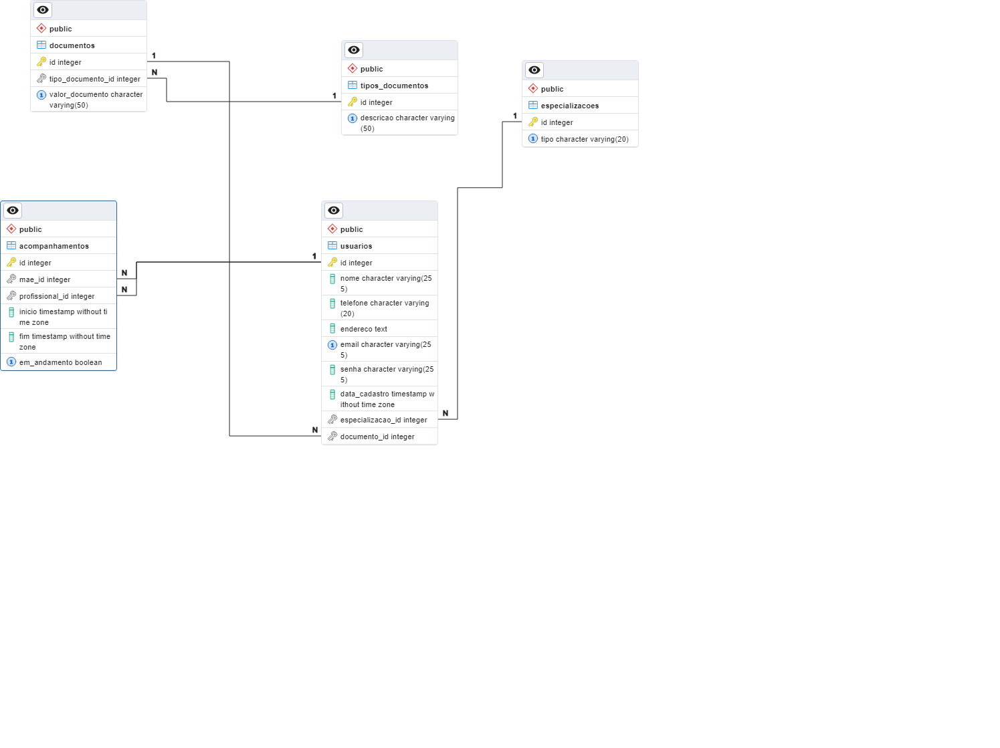

# ApoioComunitario

A aplicação de apoio comunitário tem como objetivo conectar profissionais de saúde especializados em psicologia com mães que necessitam de suporte psicológico. A solução oferecerá uma interface intuitiva, onde os psicólogos poderão acompanhar e tratar essas mães de forma personalizada e contínua. Por meio da plataforma, os profissionais terão acesso a ferramentas que facilitam o monitoramento do progresso das mães, oferecendo intervenções e suporte conforme necessário. Essa iniciativa visa criar uma rede de apoio eficaz, promovendo o bem-estar mental das mães e fortalecendo o vínculo entre comunidade e profissionais de saúde.

## Modelagem Banco de Dados

1. **Estrutura ER(Entidade Relacionamento)**



2. **Modelo DDL**

```sql
-- Tabela de tipos de documentos
CREATE TABLE tipos_documentos (
    id SERIAL PRIMARY KEY,
    descricao VARCHAR(50) NOT NULL UNIQUE CHECK (descricao IN ('CPF', 'CRP'))
);

-- Tabela de documentos
CREATE TABLE documentos (
    id SERIAL PRIMARY KEY,
    tipo_documento_id INT NOT NULL,
    valor_documento VARCHAR(50) NOT NULL UNIQUE,
    CONSTRAINT fk_tipo_documento FOREIGN KEY (tipo_documento_id) REFERENCES tipos_documentos(id) ON DELETE RESTRICT
);

-- Tabela de especializações (mães e profissionais de saúde)
CREATE TABLE especializacoes (
    id SERIAL PRIMARY KEY,
    tipo VARCHAR(20) NOT NULL UNIQUE CHECK (tipo IN ('mae', 'profissional'))
);

-- Tabela de usuários
CREATE TABLE usuarios (
    id SERIAL PRIMARY KEY,
    nome VARCHAR(255) NOT NULL,
    telefone VARCHAR(20) NOT NULL,
    endereco TEXT NOT NULL,
    email VARCHAR(255) UNIQUE NOT NULL,
    senha VARCHAR(255) NOT NULL,
    data_cadastro TIMESTAMP DEFAULT CURRENT_TIMESTAMP,
    especializacao_id INT NOT NULL,
    documento_id INT NOT NULL,
    CONSTRAINT fk_especializacao FOREIGN KEY (especializacao_id) REFERENCES especializacoes(id) ON DELETE RESTRICT,
    CONSTRAINT fk_documento FOREIGN KEY (documento_id) REFERENCES documentos(id) ON DELETE RESTRICT,
    CONSTRAINT ck_telefone CHECK (telefone ~ '^[0-9]{10,11}$'), -- Validação de telefone
    CONSTRAINT ck_email CHECK (email ~* '^[A-Z0-9._%+-]+@[A-Z0-9.-]+\.[A-Z]{2,}$')
);

-- Índice para otimizar consultas por especialização e documento
CREATE INDEX idx_usuarios_especializacao_documento ON usuarios(especializacao_id, documento_id);

-- Tabela de acompanhamentos
CREATE TABLE acompanhamentos (
    id SERIAL PRIMARY KEY,
    mae_id INT NOT NULL,
    profissional_id INT NOT NULL,
    inicio TIMESTAMP NOT NULL,
    fim TIMESTAMP,
    em_andamento BOOLEAN DEFAULT TRUE,
    CONSTRAINT fk_mae_acompanhamento FOREIGN KEY (mae_id) REFERENCES usuarios(id) ON DELETE CASCADE,
    CONSTRAINT fk_profissional_acompanhamento FOREIGN KEY (profissional_id) REFERENCES usuarios(id) ON DELETE CASCADE,
    CONSTRAINT unique_acompanhamento_per_mae UNIQUE (mae_id, em_andamento)
);

-- Trigger para garantir que uma mãe só pode ser acompanhada por um profissional por vez
CREATE OR REPLACE FUNCTION check_acompanhamento()
RETURNS TRIGGER AS $$
BEGIN
    IF EXISTS (
        SELECT 1
        FROM acompanhamentos
        WHERE mae_id = NEW.mae_id
          AND em_andamento = TRUE
          AND id <> NEW.id
    ) THEN
        RAISE EXCEPTION 'A mãe já está em acompanhamento com outro profissional.';
    END IF;
    RETURN NEW;
END;
$$ LANGUAGE plpgsql;

CREATE TRIGGER trg_check_acompanhamento
BEFORE INSERT OR UPDATE ON acompanhamentos
FOR EACH ROW
EXECUTE FUNCTION check_acompanhamento();

-- Inserção dos tipos de documentos
INSERT INTO tipos_documentos (descricao)
VALUES ('CPF'), ('CRP');

-- Inserção das especializações
INSERT INTO especializacoes (tipo)
VALUES ('mae'), ('profissional');

-- Exemplo de inserção de documentos
INSERT INTO documentos (tipo_documento_id, valor_documento)
VALUES (1, '123.456.789-00'), -- CPF para mãe
       (2, '123456'); -- CRP para profissional

-- Exemplo de inserção de usuários
INSERT INTO usuarios (nome, telefone, endereco, email, senha, especializacao_id, documento_id)
VALUES ('Maria Silva', '1234567890', 'Rua A, 123', 'maria@exemplo.com', 'senha_mae', 1, 1),
       ('Dr. João Souza', '9876543210', 'Rua B, 456', 'joao@exemplo.com', 'senha_psi', 2, 2);

-- Exemplo de inserção de acompanhamentos
INSERT INTO acompanhamentos (mae_id, profissional_id, inicio, em_andamento)
VALUES (1, 2, NOW(), TRUE);
```

**Tabela `tipos_documentos`:** Centraliza os tipos de documentos, garantindo que eles sejam consistentes e evitando duplicação de dados.

**Tabela `documentos`:** Armazena os documentos e seus valores, agora referenciados por chave estrangeira na tabela de usuarios.

**Tabela `usuarios`:** Agora contém uma chave estrangeira documento_id que referencia a tabela documentos, garantindo que cada usuário tenha um documento válido associado.

**Chaves Estrangeiras e Constraints:** As constraints ON DELETE RESTRICT garantem que um documento ou especialização não pode ser deletado se estiver sendo utilizado por algum usuário, mantendo a integridade referencial.

**Índices:** Criei índices para otimizar as consultas por especializacao_id e documento_id, melhorando o desempenho das operações comuns.

Essa abordagem melhora a organização e a integridade dos dados, além de facilitar a manutenção e a escalabilidade do sistema.

## Configuração do Ambiente

1. **Instale o Node.js:** Certifique-se de que o Node.js está instalado no seu sistema. Você pode baixá-lo de [nodejs.org](https://nodejs.org/).

2. **Instale o NestJS CLI:** Isso permitirá que você crie e gerencie projetos NestJS facilmente.

```bash
npm install -g @nestjs/cli
```

3. **Crie um novo projeto NestJS:**
```bash
nest n apoiocomunitario
```

Escolha `npm` ou `yarn` como gerenciador de pacotes, conforme sua preferência.

## Configuração do Projeto

1. **Instale as dependências necessárias:** 
```bash
cd apoiocomunitario
npm install @nestjs/typeorm typeorm pg @nestjs/jwt @nestjs/passport passport passport-jwt bcryptjs
```

- **Para integração com PostgreSQL:** `@nestjs/typeorm`, `typeorm`, `pg`
- **Para autenticação JWT:** `@nestjs/jwt`, `@nestjs/passport`, `passport`, `passport-jwt`, `bcryptjs`

2. **Configure a Conexão com o Banco de Dados:**

No arquivo `src/app.module.ts`, configure o TypeORM para se conectar ao PostgreSQL.

```typescript
// src/app.module.ts
import { Module } from '@nestjs/common';
import { TypeOrmModule } from '@nestjs/typeorm';
import { UsuariosModule } from './usuarios/usuarios.module';
import { AuthModule } from './auth/auth.module';

@Module({
  imports: [
    TypeOrmModule.forRoot({
      type: 'postgres',
      url: process.env.DATABASE_URL, // URL de conexão do banco de dados
      entities: [__dirname + '/**/*.entity{.ts,.js}'],
      synchronize: true, // Define como true apenas em desenvolvimento
    }),
    UsuariosModule,
    AuthModule,
  ],
})
export class AppModule {}


```

## Criação dos Módulos, Controladores,  Serviços e Entidades


1. **Crie o Módulo de Usuários:**

```bash
nest generate module usuarios
nest generate service usuarios
nest generate controller usuarios
```

2. **Defina a Entidade de Usuário:**

Crie um arquivo `src/usuarios/usuario.entity.ts`:

```typescript
import { Entity, PrimaryGeneratedColumn, JoinColumn, Column, OneToMany, ManyToOne } from 'typeorm';
import { Acompanhamento } from '../acompanhamentos/acompanhamento.entity';
import { Documento } from '../documentos/documento.entity';
import { Especializacao } from './especializacao.entity';

@Entity('usuarios')
export class Usuario {
  @PrimaryGeneratedColumn()
  id: number;

  @Column({ name: 'nome', length: 255 })
  nome: string;

  @Column({ name: 'telefone', length: 20 })
  telefone: string;

  @Column({ name: 'endereco', type: 'text' })
  endereco: string;

  @Column({ name: 'email', unique: true, length: 255 })
  email: string;

  @Column({ name: 'senha', length: 255 })
  senha: string;

  @Column({ name: 'data_cadastro', type: 'timestamp', default: () => 'CURRENT_TIMESTAMP' })
  dataCadastro: Date;

  @Column({ name: 'especializacao_id' })
  especializacao_id: number;

  @Column({ name: 'documento_id' })
  documento_id: number;

  @ManyToOne(() => Especializacao, { nullable: false })
  @JoinColumn({ name: 'especializacao_id' })
  especializacao: Especializacao;

  @ManyToOne(() => Documento, { nullable: false })
  @JoinColumn({ name: 'documento_id' })
  documento: Documento;

  @OneToMany(() => Acompanhamento, (acompanhamento) => acompanhamento.mae)
  acompanhamentosComoMae: Acompanhamento[];

  @OneToMany(() => Acompanhamento, (acompanhamento) => acompanhamento.profissional)
  acompanhamentosComoProfissional: Acompanhamento[];
}
```

3. **Serviço de Usuários:**

Implemente o serviço para criar, buscar e gerenciar usuários em `src/usuarios/usuarios.service.ts`.

```typescript
import { Injectable } from '@nestjs/common';
import { InjectRepository } from '@nestjs/typeorm';
import { Repository } from 'typeorm';
import { Usuario } from './usuario.entity';
import { Especializacao } from './especializacao.entity';
import { Documento } from '../documentos/documento.entity';
import * as bcrypt from 'bcryptjs';

@Injectable()
export class UsuariosService {
  constructor(
    @InjectRepository(Usuario)
    private readonly usuariosRepository: Repository<Usuario>,
    @InjectRepository(Especializacao)
    private readonly especializacoesRepository: Repository<Especializacao>,
    @InjectRepository(Documento)
    private readonly documentosRepository: Repository<Documento>,
  ) {}

  async findAll(): Promise<Usuario[]> {
    return this.usuariosRepository.find();
  }

  async findOne(id: number): Promise<Usuario> {
    return this.usuariosRepository.findOneBy({ id: id });
  }

  async findByEmail(email: string): Promise<Usuario | undefined> {
    return this.usuariosRepository.findOne({ where: { email } });
  }

  async createUsuario(
    usuarioData: Partial<Usuario>,
    especializacaoId: number,
    tipoDocumentoId: number,
  ): Promise<Usuario> {
    
    // Criando o documento
    const documento = new Documento();
    documento.tipo_documento_id = tipoDocumentoId;
    documento.valor_documento = usuarioData.documento.toString();;
    const documentoSalvo = await this.documentosRepository.save(documento);

    // Criando o usuário
    const salt = bcrypt.genSaltSync(10);
    const novoUsuario = this.usuariosRepository.create({
      ...usuarioData,
      senha: bcrypt.hashSync(usuarioData.senha, salt),
      especializacao_id: especializacaoId,
      documento_id: documentoSalvo.id,
    });

    return this.usuariosRepository.save(novoUsuario);
  }


  async update(id: number, usuario: Partial<Usuario>): Promise<void> {
    await this.usuariosRepository.update(id, usuario);
  }

  async remove(id: number): Promise<void> {
    await this.usuariosRepository.delete(id);
  }
}
```

4. **Controlador de Usuários:**

No controlador `src\usuarios\usuarios.controller.ts`, você cria endpoints para interagir com os usuários, como criar, atualizar e buscar.

```typescript
import { Controller, Get, Post, Body, Param, Put, Delete, HttpCode, HttpStatus } from '@nestjs/common';
import { UsuariosService } from './usuarios.service';
import { Usuario } from './usuario.entity';
import { UseGuards } from '@nestjs/common';
import { JwtAuthGuard } from '../auth/jwt-auth.guard';

@Controller('usuarios')
export class UsuariosController {
  constructor(private readonly usuariosService: UsuariosService) {}
  @UseGuards(JwtAuthGuard)
  @Get()
  findAll(): Promise<Usuario[]> {
    return this.usuariosService.findAll();
  }

  @UseGuards(JwtAuthGuard)
  @Get(':id')
  findOne(@Param('id') id: number): Promise<Usuario> {
    return this.usuariosService.findOne(id);
  }

  @Post('maes')
  async createMae(@Body() usuarioData: Partial<Usuario>): Promise<Usuario> {
    return this.usuariosService.createUsuario(usuarioData, 1, 1);
  }

  @Post('psi')
  async createPsi(@Body() usuarioData: Partial<Usuario>): Promise<Usuario> {
    return this.usuariosService.createUsuario(usuarioData, 2, 2);
  }

  @UseGuards(JwtAuthGuard)
  @Put(':id')
  update(@Param('id') id: number, @Body() usuario: Usuario): Promise<void> {
    return this.usuariosService.update(id, usuario);
  }

  @UseGuards(JwtAuthGuard)
  @Delete(':id')
  remove(@Param('id') id: number): Promise<void> {
    return this.usuariosService.remove(id);
  }
}
```

5. **Modulo de Usuários:**

Ajuste o modulo `src\usuarios\usuarios.module.ts`

```typescript
import { Module } from '@nestjs/common';
import { TypeOrmModule } from '@nestjs/typeorm';
import { UsuariosService } from './usuarios.service';
import { UsuariosController } from './usuarios.controller';
import { Usuario } from './usuario.entity';
import { Especializacao } from './especializacao.entity';
import { Documento } from '../documentos/documento.entity';

@Module({
  imports: [TypeOrmModule.forFeature([Usuario, Especializacao, Documento])],
  providers: [UsuariosService],
  controllers: [UsuariosController],
  exports: [UsuariosService],
})
export class UsuariosModule {}

```

6. **Criação da Entidade Especializacao:**

Crie o arquivo `especializacao.entity.ts` dentro da pasta `usuarios`:

```typescript
import { Entity, PrimaryGeneratedColumn, Column, ManyToOne, OneToMany } from 'typeorm';
import { Usuario } from './usuario.entity';

@Entity('especializacoes')
export class Especializacao {
  @PrimaryGeneratedColumn()
  id: number;

  @Column({ name: 'tipo', length: 20 })
  tipo: string;

  @OneToMany(() => Usuario, (usuario) => usuario.especializacao)
  usuarios: Usuario[];
}
```

7. **Criação da Entidade Documento:**

Crie a pasta `documentos`:
```bash
mkdir src/documentos
```

Crie o arquivo `documento.entity.ts` dentro da pasta `documentos`:

```typescript
import { Entity, PrimaryGeneratedColumn, JoinColumn, Column, OneToMany, ManyToOne } from 'typeorm';
import { TiposDocumentos } from './tipos-documentos.entity';

@Entity('documentos')
export class Documento {
  @PrimaryGeneratedColumn()
  id: number;

  @Column({ name: 'tipo_documento_id' })
  tipo_documento_id: number;

  @ManyToOne(() => TiposDocumentos, (tipoDocumento) => tipoDocumento.id)
  @JoinColumn({ name: 'tipo_documento_id' })
  tipoDocumento: TiposDocumentos;

  @Column({ name: 'valor_documento', unique: true, length: 50, type: 'varchar' })
  valor_documento: string;
}

```

8. **Criação da Entidade TiposDocumentos:**

Crie o arquivo `tipos-documentos.entity.ts` dentro da pasta `documentos`:

```typescript
import { Entity, PrimaryGeneratedColumn, Column, ManyToOne, OneToMany } from 'typeorm';

@Entity('tipos_documentos')
export class TiposDocumentos {
  @PrimaryGeneratedColumn()
  id: number;

  @Column({ unique: true, length: 50, type: 'varchar' })
  descricao: string;
}
```

8. **Criação da Entidade Acompanhamento:**

Crie a pasta `acompanhamentos`:
```bash
mkdir src/acompanhamentos
```

Crie o arquivo `acompanhamento.entity.ts` dentro da pasta `acompanhamentos`:

```typescript
import { Entity, PrimaryGeneratedColumn, Column, ManyToOne } from 'typeorm';
import { Usuario } from '../usuarios/usuario.entity';

@Entity('acompanhamentos')
export class Acompanhamento {
  @PrimaryGeneratedColumn()
  id: number;

  @ManyToOne(() => Usuario, (usuario) => usuario.acompanhamentos, { nullable: false })
  mae: Usuario;

  @ManyToOne(() => Usuario, (usuario) => usuario.acompanhamentos, { nullable: false })
  profissional: Usuario;

  @Column({ type: 'timestamp' })
  inicio: Date;

  @Column({ type: 'timestamp', nullable: true })
  fim: Date;

  @Column({ type: 'boolean', default: true })
  emAndamento: boolean;
}
```

## Implementação da Autenticação JWT

1. **Crie o Módulo de Autenticação:**

```bash
nest generate module auth
nest generate service auth
nest generate controller auth
```

2. **Serviço de Autenticação:**

Em `src/auth/auth.service.ts`, implemente a lógica para validar usuários e gerar tokens JWT.

```typescript
import { Injectable } from '@nestjs/common';
import { JwtService } from '@nestjs/jwt';
import { UsuariosService } from '../usuarios/usuarios.service';
import * as bcrypt from 'bcryptjs';

@Injectable()
export class AuthService {
  constructor(
    private readonly usuariosService: UsuariosService,
    private readonly jwtService: JwtService,
  ) {}

  async validateUser(email: string, senha: string): Promise<any> {
    const usuario = await this.usuariosService.findByEmail(email);
    if (usuario && bcrypt.compareSync(senha, usuario.senha)) {
      const { senha, ...result } = usuario;
      return result;
    }
    return null;
  }

  async login(user: any) {
    const payload = { email: user.email, sub: user.id };
    return {
      access_token: this.jwtService.sign(payload),
    };
  }
}
```

3. **Estratégia de JWT:**

Em `src/auth/jwt.strategy.ts`, configure a estratégia JWT para autenticar as requisições.

```typescript
import { Injectable } from '@nestjs/common';
import { PassportStrategy } from '@nestjs/passport';
import { Strategy, ExtractJwt } from 'passport-jwt';
import { AuthService } from './auth.service';

@Injectable()
export class JwtStrategy extends PassportStrategy(Strategy) {
  constructor(private readonly authService: AuthService) {
    super({
      jwtFromRequest: ExtractJwt.fromAuthHeaderAsBearerToken(),
      ignoreExpiration: false,
      secretOrKey: 'your_secret_key',
    });
  }

  async validate(payload: any) {
    return { userId: payload.sub, email: payload.email };
  }
}
```

4. **Controlador de Autenticação:**
Em `src/auth/auth.controller.ts`, implemente os endpoints para login.

```typescript
import { Controller, Post, Body } from '@nestjs/common';
import { AuthService } from './auth.service';

@Controller('auth')
export class AuthController {
  constructor(private readonly authService: AuthService) {}

  @Post('login')
  async login(@Body() user: any) {
    return this.authService.login(user);
  }
}
```

5. **Protegendo Endpoints:**

Para proteger endpoints usando JWT, utilize o guard AuthGuard do Passport.

No controlador de usuários, adicione a seguinte linha:

```typescript
import { UseGuards } from '@nestjs/common';
import { JwtAuthGuard } from '../auth/jwt-auth.guard';

@Controller('usuarios')
export class UsuariosController {
  @UseGuards(JwtAuthGuard)
  @Get()
  findAll(): Promise<Usuario[]> {
    // ...
  }
}
```

6. **Criação do Guard de JWT:**

Em `src/auth/jwt-auth.guard.ts`:

```typescript
import { Injectable } from '@nestjs/common';
import { AuthGuard } from '@nestjs/passport';

@Injectable()
export class JwtAuthGuard extends AuthGuard('jwt') {}
```

## Testando a Aplicação
1. **Inicie o servidor:**
```bash
npm run start:dev
```
2. **Testar Endpoints:**

- **Autenticar:**  Envie uma requisição POST para `/auth/login` com os dados do usuário.

```bash
curl -X POST http://localhost:3000/auth/login \
     -H "Content-Type: application/json" \
     -d '{"email": "usuario@exemplo.com", "senha": "senha_do_usuario"}'
```

- **Criar Usuários:** Envie uma requisição POST para `/usuarios/{especializacao}` com os dados do usuário.

A `especializacao` pode ser `maes` ou `psi`.

```bash
curl -X POST http://localhost:3000/usuarios/{especializacao} \
     -H "Content-Type: application/json" \
     -d '{
       "nome": "Ana Costa",
       "telefone": "1234567890",
       "endereco": "Avenida B, 789",
       "email": "ana@exemplo.com",
       "senha": "senha_segura",
       "documento": "0000"
     }'
```
- **Acessar Dados Protegidos:** Envie requisições GET para `/usuarios`, `/usuarios/{id}` ou `/acompanhamentos`, `/acompanhamentos/{id}` com o token JWT no cabeçalho de autorização com Beare.